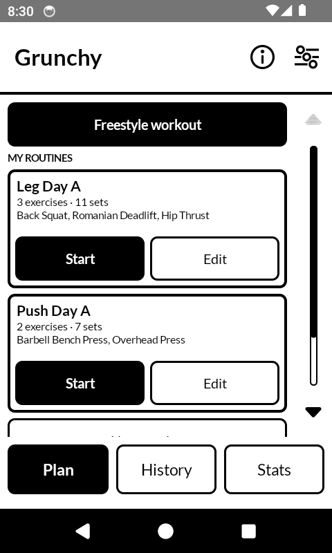
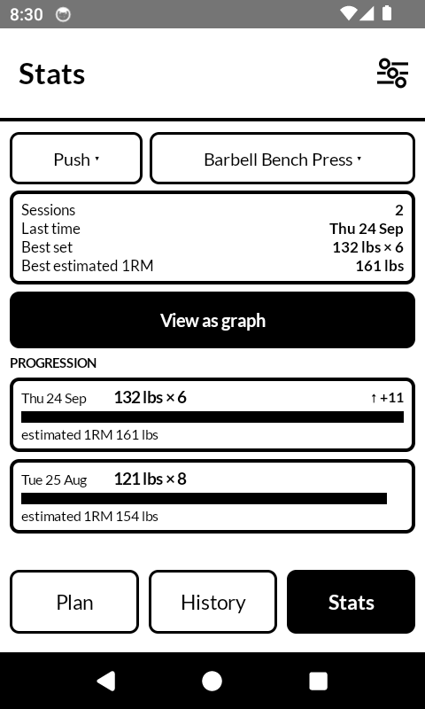
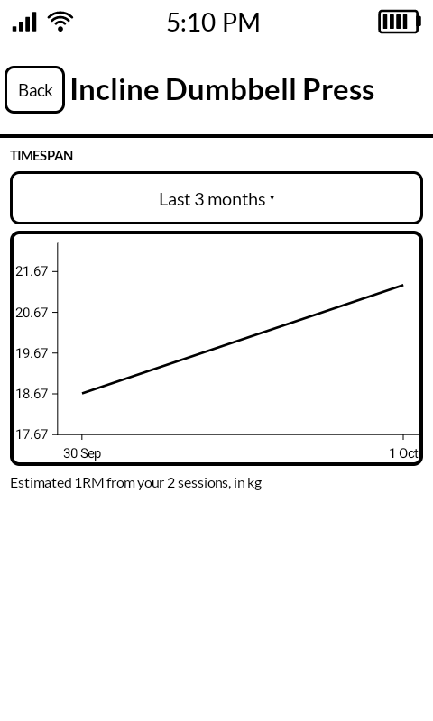
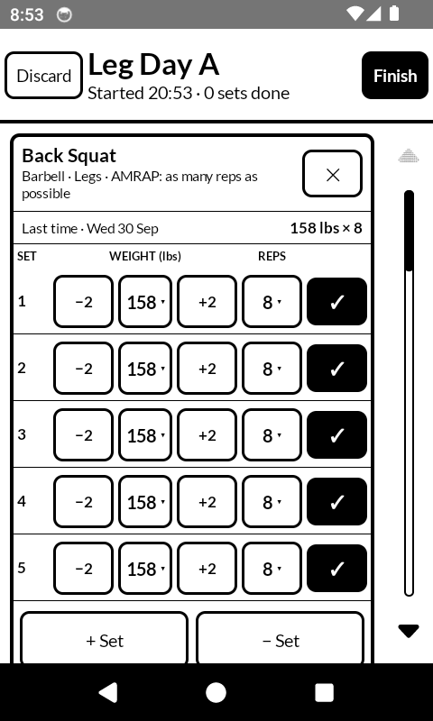
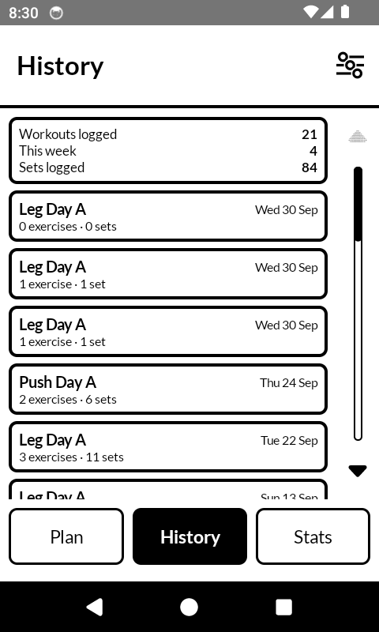
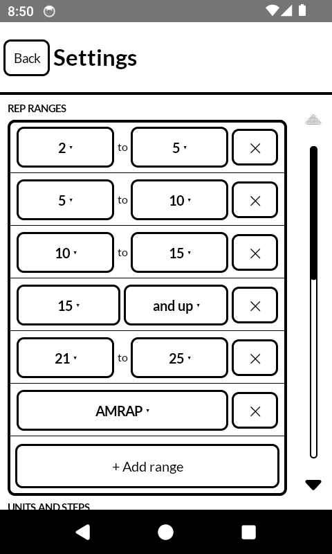
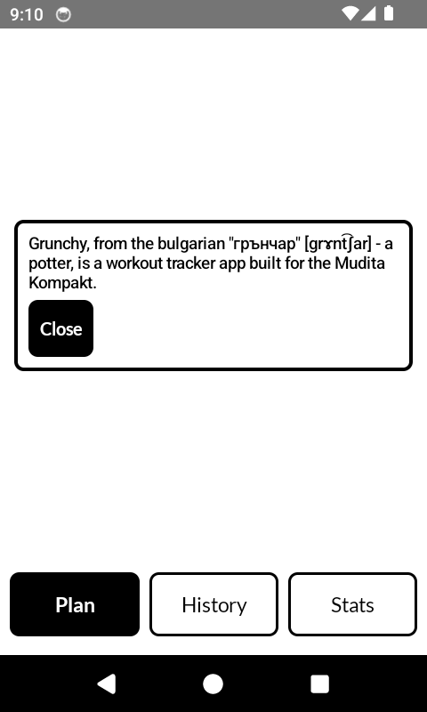
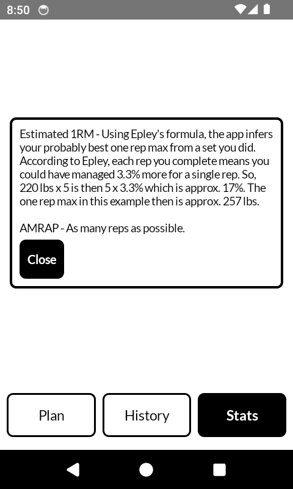

# Grunchy — workout tracker for the Mudita Kompakt

A minimalist strength-training log built for a 4.3" E Ink panel: **you never have to type a
number**. Weights, reps, rep ranges, set counts and routine names all come from dropdowns and
± buttons.

The name is Bulgarian — *grunchar* is a potter — so the launcher icon is a vase rather than a
barbell. The story itself is not printed on the plan screen: it sits behind the ⓘ in the app bar,
one tap away, where it does not compete with the title.

The UI is built on [Mudita Mindful Design (MMD)](https://github.com/mudita/MMD) 1.0.2, the
E Ink optimised Material 3 component library Mudita ships for the Kompakt.

## Download

Grab `grunchy-1.0.apk` from [Releases](https://github.com/madnessofdoubt/grunchy/releases/latest)
and install it on the phone (`adb install -r grunchy-1.0.apk`), or open it on the device itself.

## Screenshots

Taken on the Kompakt itself: 1-bit, no animation, 480 x 800.

| Plan | Stats | Progress graph |
| --- | --- | --- |
|  |  |  |

| Workout | Session history | Settings |
| --- | --- | --- |
|  |  |  |

The two ⓘ cards, which explain the name and the estimate:

| The name | Estimated 1RM, and AMRAP |
| --- | --- |
|  |  |

## Why it is shaped like this

| Screen | What you do there |
| --- | --- |
| **Plan** | Start a freestyle workout, or tap *Start* on a saved routine. The ⓘ explains the name |
| **Workout** | Each set has a coarse weight dropdown, `±` fine buttons, a reps dropdown and one tick — all in kilos or pounds, whichever you picked. Above them, what you did last time |
| **Stats** | Pick an exercise (or land on the one you last trained) and see every session as its top set plus an estimated 1RM. *View as graph* draws the same history as a line. The ⓘ explains the estimate |
| **Settings** | Behind the sliders button in the app bar: weight unit, rep ranges, picker step sizes, stored data, clear history. Not a tab, so the three tabs get the whole bar |

The chrome follows the native Mudita apps, measured off screenshots rather than guessed: a 76 dp
app bar with a bold ~25 sp title over a **3 dp** full-width rule (MMD's own divider renders 1 dp —
it hands its 3 dp to the modifier's *width* instead of the divider's thickness, so the rule is
drawn by hand), and the settings glyph drawn as three sliders with hollow knobs, because MMD
ships components but no icon set.

Keyboard-free by design:

* Routine names come from a 14-entry dropdown — *Custom name…* opens a text field only if you insist.
* Exercises come from a two-step picker: muscle group (Push / Pull / Legs / Core), then exercise.
* **Targets are rep ranges, not single numbers** (1-5, 5-10, 10-15, 15+ by default, and you can
  reshape or add your own in Settings with two dropdowns — still no typing). A new set starts in
  the middle of its range: 5-10 starts at 8. **AMRAP** sits in the same picker as a single choice
  rather than a range: it has no upper bound to set, so picking it leaves the row with one control
  where a range has two.
* **Sets arrive pre-filled from your last session** for the same exercise, so a straight-set
  workout is: tick, tick, tick.
* **The top set from last time sits above the pickers** (`Last time · Tue 22 Sep  ⟶  72.5 kg × 5`)
  so you can see what you are trying to beat without leaving the logging screen.
* **Completing a set propagates its weight and reps to the sets below it that you have not
  touched.** Change 60 kg once, log five sets, done. Adjust a back-off set by hand and it is
  left alone.
* 0 kg means bodyweight — no unit switching needed.

## Estimated 1RM, and why it is there

`est. 1RM` is the one-rep max you *probably* have, inferred from a set you actually did —
nobody tested the single. The app uses Epley's formula:

```
1RM ≈ weight × (1 + reps / 30)
```

Epley adds 1/30 of the load per rep. At 20 kg that is 0.67 kg per rep, so **20 kg × 8 reads as
25.33 kg** — the app is saying "eight reps at 20 kg is about as hard as one rep at 25 kg".

It exists because rep *ranges* make raw weights incomparable: 72.5 kg × 5 and 60 kg × 12 are
not obviously better or worse than each other, and the estimate flattens both onto one axis.
So the progression chart scales by it and "Best set" is picked with it.

Honest caveat: Epley is linear and starts lying past ~10–12 reps. At 40 kg × 20, Epley says
66.7 kg while Brzycki says 84.7 kg — a 27% spread, i.e. noise. So the app shows no estimate
for sets above 12 reps (`MaxRepsForE1rm`), and the row says so instead. The ⓘ in the Stats app bar
explains the same thing on the device, in the user's own words, and defines AMRAP beside it.

## The progress graph

*View as graph* on Stats opens the estimated 1RM of one exercise over time, drawn with
[Vico](https://github.com/patrykandpatrick/vico).

- **Timespan first, then the line.** The graph opens on three months and offers a month, three
  months, six months, a year, or everything. A log kept for years is unreadable as one line, and
  the question is nearly always "am I still going the right way", which the recent window answers.
- **One point per session until it is too dense.** Past 54 points — a year of training three
  times a week — each week is represented by its best session, and past that each month is. The
  caption says which of the three you are looking at, so a line of weekly bests is never mistaken
  for a line of sessions.
- **Sessions with no estimate are left out, and said to be left out.** When every set went past
  twelve reps there is no honest 1RM, so the note under the chart names how many sessions in the
  window carry no estimate rather than quietly plotting the top set and flattering the line.
- **Nothing about the chart moves.** Scrolling, zooming and animation are all off: on this panel
  a fling repaints for every frame, and the timespan dropdown is the zoom. The x-range is fitted
  to the width with Vico's fixed *content* zoom for the same reason — Vico lays an x-step out at a
  fixed number of dp, so a chart that is not explicitly fitted only ever shows its first days.
- **One unit, one axis.** The y-axis is in the unit chosen in Settings and the caption names it;
  sets are still stored in kilos like everything else.

## Kilos and pounds

Weights are shown in whichever unit you pick in Settings, and every screen follows: the weight
picker, the logged set rows, the "last time" line, best sets and estimated 1RMs.

Sets are **stored in kilos** either way, so switching the unit is a display change and never
rewrites history. Pounds round to the whole pound on screen — that is the increment a
pound-based gym has plates for, and a weight converted from an older kilo log has no business
claiming a tenth of a pound. Log 156 lbs and the file keeps 70.7604 kg; it reads back as 156 lbs.

The three step settings (*weight jumps in the dropdown*, *fine step for the ± buttons*,
*heaviest weight in the list*) are expressed in the chosen unit rather than in kilos, so
switching picks the **equivalent choice** instead of converting the number: 5 kg jumps become
10 lb jumps, not 11.02 lb ones. Switching back returns 5 kg, 0.5 kg and 260 kg.

## E Ink decisions

* No animations anywhere. `android:windowAnimationStyle` is nulled so even activity
  transitions cost no panel refreshes, and there is not a single `animate*AsState`,
  `AnimatedVisibility` or transition in the app code.
* Ripple is disabled globally by `ThemeMMD` (`LocalRippleConfiguration = null`).
* Pure black on pure white. Greys dither on a 1-bit panel, so there are no disabled buttons
  (`Add exercise` shows a hint instead of greying out) and "muted" text means *smaller*, not grey.
* No elevation, no shadows, no gradients — hard 2–3 dp borders instead.
* The launcher icon is a flat black vase on white, drawn as a vector.
* Bottom navigation is hand-rolled rather than `NavigationBarMMD`, because MMD's navigation
  bar animates its selection indicator.
* Rows are sized for a 360 × 601 dp viewport (480 × 800 px at 213 dpi — the Kompakt's panel).

## Data

Everything lives in one JSON file in the app's private storage
(`/data/data/com.grunchy.workout/files/grunchy.json`), written atomically (temp file +
rename) on every tap. There is no database, no network permission, and no Google services
dependency — the Kompakt runs MuditaOS K, which is AOSP without Play Services.

Exercise ids are stable strings (`back_squat`), so history keeps working even if the library
is edited; unknown ids fall back to a readable placeholder instead of crashing. Routines store
a rep range by its *label* (`"5-10"`), so reshaping a range in Settings never breaks a routine,
and a routine pointing at a range you deleted still loads and pre-fills sensibly. AMRAP is stored
the same way — a range whose label is `"AMRAP"` — so a routine targets it exactly like `"5-10"`.

There is no volume tracking: total tonnage says more about how long you trained than how
strong you are getting.

## Build

Run `./gradlew :app:lintDebug` before installing. Its `NewApi` check is the only automated thing
that catches a call this device's Android does not have: the `kompakt` AVD runs **API 34** while
the Kompakt itself runs **API 31**, so a call added in API 33 compiles cleanly, passes the JVM unit
tests, and throws `NoSuchMethodError` on the phone. That is not hypothetical —
`LocalDate.ofInstant` did exactly this to the graph screen, in a build that every test in this repo
called green.

Vico is pinned to the 3.2 line on purpose: 3.3.x ships Kotlin 2.4 metadata (`kotlin-stdlib`
2.4.10), which this project's Kotlin 2.2 compiler refuses to read. 3.2.3 is the newest release it
can. Check a library's `kotlin-stdlib` in its POM before adopting it.

Requires JDK 17+ and an Android SDK with API 37 platform + build-tools 36.

```bash
./gradlew :app:assembleDebug          # APK at app/build/outputs/apk/debug/app-debug.apk
./gradlew :app:testDebugUnitTest      # 32 unit tests, no device needed
```

## Install on the Kompakt

MuditaOS K can sideload APKs over USB:

```bash
adb install -r app/build/outputs/apk/debug/app-debug.apk
```

Optional release build: create a keystore and export its details, then Gradle signs the
release variant with it (nothing secret is stored in the project):

```bash
keytool -genkeypair -v -keystore grunchy.jks -alias grunchy \
        -keyalg RSA -keysize 2048 -validity 10000
export GRUNCHY_KEYSTORE=$PWD/grunchy.jks GRUNCHY_KEYSTORE_PASSWORD=... \
       GRUNCHY_KEY_ALIAS=grunchy GRUNCHY_KEY_PASSWORD=...
./gradlew :app:assembleRelease
```

## Layout

```
app/src/main/java/com/grunchy/workout/
├── MainActivity.kt            single activity, ThemeMMD, no transitions
├── model/Models.kt            Exercise, Routine, Session, Settings (serializable state)
├── data/Store.kt              atomic JSON persistence
├── data/ExerciseLibrary.kt    120 preset exercises, grouped Push/Pull/Legs/Core
├── util/Format.kt             short number/date formatting (fewest glyphs)
├── util/Stats.kt              estimated 1RM, progression points, last top set
├── util/RepRanges.kt          rep range labels, prefill and editing rules
├── util/Units.kt              kilos <-> pounds, per-unit steps and rounding
└── ui/
    ├── AppRoot.kt             screen state + back stack + bottom bar
    ├── AppState.kt            state holder, writes through to disk on every change
    ├── ActiveWorkout.kt       the session in progress, pre-fill and set propagation
    ├── Controls.kt            ValueDropdown, WeightPicker, StepButton, …
    ├── ScrollList.kt          the scrolling list + scrollbar (MMD's look, finer gestures)
    └── *Screen.kt             Plan, RoutineEditor, Workout, History, SessionDetail,
                               Progress (Stats), Settings
```

## Not included (deliberately)

* Rest timer — a live countdown means a full panel refresh every second, which is exactly
  what E Ink is bad at.
* Syncing, accounts, sharing — the Kompakt is a de-Googled device; this app talks to nothing.
## Tools

`tools/` holds the verification harnesses. They drive the running app over `adb` by reading
Compose's accessibility tree, so they assert on what the screen actually says rather than on
pixels. See [tools/README.md](tools/README.md).

## Licence

Apache-2.0 — see [LICENSE](LICENSE) and [NOTICE](NOTICE).

Copyright 2026 Stan Dinev.

The UI is built on [Mudita Mindful Design](https://github.com/mudita/MMD) and the progress graph
draws on [Vico](https://github.com/patrykandpatrick/vico). Both are Apache-2.0.
